# 环境搭建教程

## 工具链介绍

适用环境：Windows + VS Code + Arm Keil Studio

### 1.1 从工程到固件

我们通常使用 C/C++ 编写程序，而 CPU 执行的是机器指令。因此，需要编译器及配套工具把源码转换成目标芯片能执行的固件。<br>
一般要经历以下几步

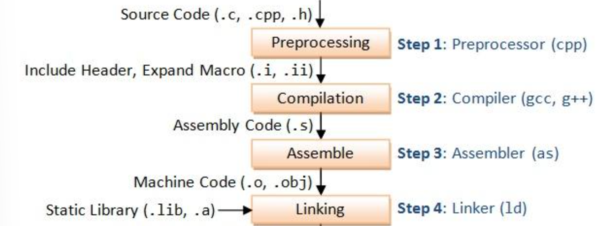

**预处理**：展开头文件和宏，处理条件编译，确定实际参与编译的代码。预处理后的 C 源码在保存为中间文件时，通常使用 `.i` 扩展名。

**编译**：检查代码的语法和含义，进行优化，并生成目标平台的汇编代码。例如 `result = xxx(A)`，编译将这步拆成准备参数、调用函数、取得返回值并赋给变量；优化后实现方式可能不同，例如函数被内联，不再发生实际调用。若保存该阶段的中间结果，通常是 `.s` 汇编文本（助记符），还不是机器码。正常构建不一定单独保存 `.i` 和 `.s` 中间文件。

**汇编**：将汇编指令编码成机器码，生成 `.o` 目标文件。

**链接**：合并目标文件和所需库，解析函数与变量的引用，例如 `main.o` 调用的 `xxx` 定义在 `motor.o` 中，链接器会找到它，并修正对应的调用地址。最终的固件是`.axf`

### 1.2 工具链介绍

之前的开发链是使用 **STM32CubeMX + Keil µVision** ，keil作为一款古老的ide，代码写起来比较难受，跳转经常有bug，补全也很难用<br>
我们使用vscode来帮助提升写代码体验，使用Cmsis toolbox keil studio帮忙编译和烧录，这样用的还是AC6的编译器然后不用手写(让ai写)Cmakelists等等，且还能兼容之前的keil

| **开发步骤** | **传统 µVision + CubeMX** | **当前 Keil Studio 流程** |
| --- | --- | --- |
| ① 配置引脚、时钟和外设 | CubeMX 配置 `.ioc`，生成初始化代码和 MDK 工程 | CubeMX 配置 `.ioc`，生成初始化代码和 MDK 工程 |
| ② 管理工程 | µVision 读取 `.uvprojx`，管理源文件、宏和编译选项 | 将 `.uvprojx` 转成 CMSIS YAML，之后由 CMSIS Solution 管理 |
| ③ 准备工具和依赖 | 安装 MDK 中的编译工具，通过 Pack Installer 安装所需 Pack | 工具环境管理器按 `vcpkg-configuration.json` 安装、激活工具；CMSIS 工具安装所需 Pack |
| ④ 编辑代码 | µVision 编辑器 | VS Code 编辑器，clangd 提供补全和跳转 |
| ⑤ 组织构建 | µVision 的构建系统调用编译工具 | CMSIS-Toolbox 解析工程 → CMake 生成规则 → Ninja 调用编译工具 |
| ⑥ 编译、汇编、链接 | AC6 | AC6 |

### 1.3 工具链调用流程

```text
VS Code 小锤子
  ↓
cbuild                       ← CMSIS-Toolbox 提供，组织整个构建过程
  ↓
解析工程 YAML，生成 CMake 工程
  ↓
CMake                        ← 生成 Ninja 构建规则
  ↓
Ninja                        ← 按依赖顺序、并行执行命令
  ↓
AC6 的编译器、汇编器、链接器
  ↓
固件 .axf
```

**原生 Keil µVision：**

```text
Keil 的 Build 按钮
  ↓
µVision 内置构建管理器
  ↓
读取 .uvprojx 工程配置
（源文件、头文件路径、宏定义、编译参数等）
  ↓
判断哪些文件需要重新编译，并组织执行
  ↓
AC6 的编译器、汇编器、链接器
  ↓
固件 .axf
```

## 环境配置教程

### 扩展安装

stm32cubemx安装，这个没有什么好说的，一路点下去就好统一**6.10.0**版本，群里有安装包

安装 [VS Code](https://code.visualstudio.com/)，再在扩展中搜索 **Arm Keil Studio Pack (MDK v6)**，确认发布者为 **Arm** 后安装。

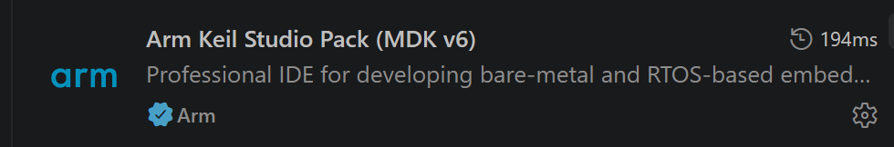

Keil Studio Pack 是 Arm 提供的 **VS Code 扩展集合**，把工程管理、工具环境、代码补全和硬件调试接入 VS Code。安装这个入口扩展，会同时安装它依赖的多个扩展。[官方扩展介绍](https://marketplace.visualstudio.com/items?itemName=Arm.keil-studio-pack)

| **扩展** | **负责什么** | **本教程里会用到的地方** |
| --- | --- | --- |
| **Arm CMSIS Solution** | 管理 CMSIS 工程、目标和软件组件，组织构建 | 转换 `.uvprojx`、打开 `.csolution.yml`、选组件、点小锤子 |
| **Arm Tools Environment Manager** | 根据工具清单下载、安装并激活工具 | 读取 `vcpkg-configuration.json`，准备 AC6、CMake、Ninja 等 |
| **Arm CMSIS Debugger** | 连接目标板，提供下载和调试能力 | 烧录、打断点、单步和查看变量 |
| **clangd** | 解析 C/C++ 代码，提供补全、诊断和符号导航 | 写代码时的补全、悬停提示和 F12 跳转 |

**安装扩展之后，工具和软件包会在构建时自己下载**

```text
安装 Keil Studio Pack → 安装配套扩展
打开并激活工具清单   → 环境管理器准备编译工具
打开、构建 CMSIS 工程 → CMSIS 工具检查并安装缺少的 Pack
（所需版本已安装在默认目录 %LOCALAPPDATA%\Arm\Packs 时可直接复用；其他目录见下方配置）
```

**之前已经安装过 Pack**

Windows 默认 Pack 仓库是 `%LOCALAPPDATA%\Arm\Packs`。这是 CMSIS 工具的默认仓库。未另行指定 Pack 路径时，只要工程要求的包及版本已正确安装在这里，就不需要重复下载或额外配置。[官方安装说明](https://github.com/Open-CMSIS-Pack/cmsis-toolbox/blob/main/docs/installation.md)

如果已有 Pack 安装在其他位置，可以在 **Windows 用户环境变量**中指定：

1. 开始菜单搜索“编辑账户的环境变量”，打开环境变量设置。
2. 在上方“用户变量”中新增或编辑 `CMSIS_PACK_ROOT`。
3. 变量值填写实际的 Pack 仓库根目录，不要加引号，也不要填到某个包的版本目录。
4. 保存后完全退出所有 VS Code 窗口，再重新打开工程，让扩展和新终端读取新环境变量。

### 怎么编译


图 1 **Convert a μVision Project to CMSIS Solution**。

这是首次迁移要做的。如果拿到的是已转换好的 CMSIS 工程，就直接打开对应 solution，不要每次重新转换。该转换流程适用于 **Arm Compiler 6（AC6）** 工程；使用 Arm Compiler 5（AC5）的工程需要先迁移到 AC6，再进行转换。

1. 找到 `MDK-ARM/xxxx.uvprojx`。
2. 右键选择 **Convert μVision project to CMSIS solution**。
3. 打开“查看 → 输出”，选择 **CMSIS Solution**，检查转换信息；也可查看生成的 `uv2csolution.log`。

转换后通常能看到(这里以h723.uvprojx转换结果为例子)：

```text
MDK-ARM/
  h723.csolution.yml
  h723.cproject.yml
  h723_h723.sct
  vcpkg-configuration.json
```

`vcpkg-configuration.json`相当于一个环境管理器，里面的内容规定了为该工作区提供了什么版本的软件包


右键当前工作区使用的 `vcpkg-configuration.json`，选择 **Activate Environment**。修改配置后使用 **Reactivate Environment**，或再次激活。编译之前看看有没有active过环境


在“**输出 → Arm Tools**”检查：

- 下载或安装是否成功；
- 实际选中了哪些版本；
- `Activated environment at ...` 指向哪份配置。

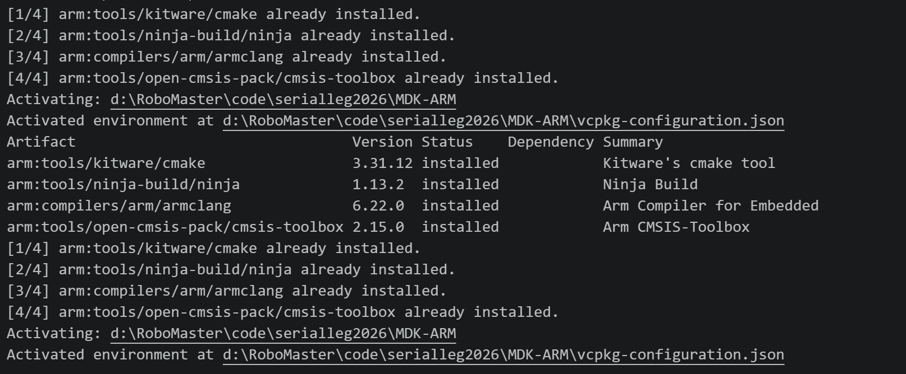

“激活”会把工具路径加入 VS Code 的工作环境。

#### 激活 AC6（armclang）许可证

**安装好 AC6 后、首次构建之前，还要确认编译器许可证已激活。**本教程使用适用于**非商业用途**的 Keil MDK Community 许可证。

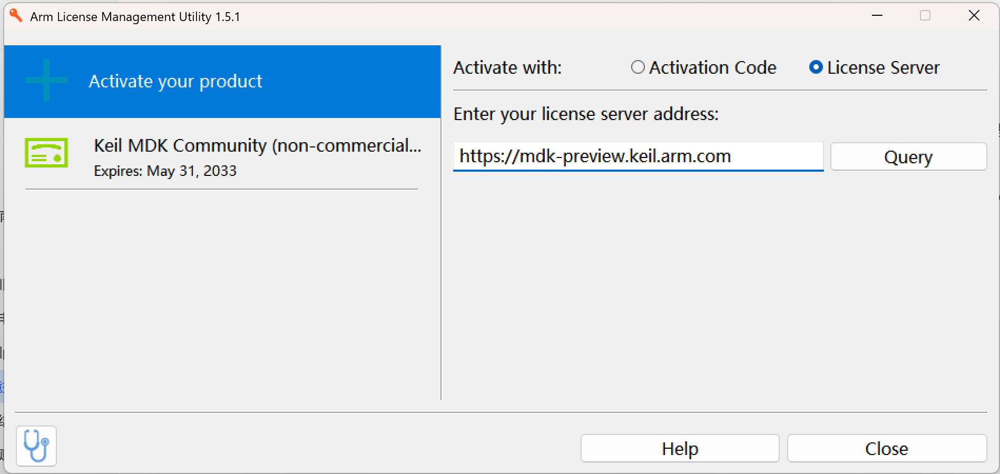

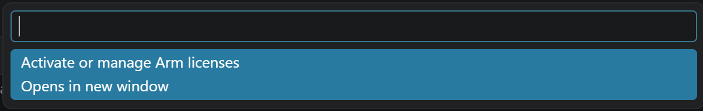

点击许可证提示中的 **Manage Arm license**，也可以点击底部状态栏的许可证状态进入管理入口。在弹出的选项中选择 **Activate or manage Arm licenses**，打开 **Arm License Management Utility**，再按下面的步骤激活 Community 许可证。

1. 点击 **License Server...**。
2. 在服务器地址栏填写 `https://mdk-preview.keil.arm.com`。
3. 点击 **Query**，选择 **Keil MDK Community**，再点击 **Activate**。
4. 确认激活成功后关闭许可证管理窗口，返回 VS Code。

#### 打开 Solution ,编译构建

| **操作** | **主要结果** | **是否需要连接开发板** |
| --- | --- | --- |
| Build | 在电脑上生成固件 | 不需要 |
| Load & Run | 下载固件并启动运行 | 需要 |
| Load & Debug | 下载固件并建立调试会话 | 需要 |


点一下**小锤子**就可以构建了

如果在上一步没有安装pack，在这里点击构建的时候就会自动安装pack

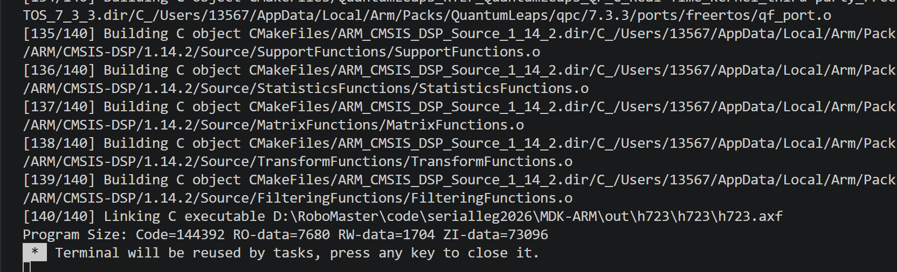

Terminal中这样显示编译通过了

#### Keil安装

其实这条工具链用不到keil，但是安装包也发在群里了，也是一路点下去

安装中可能跳出pack install


不用管，叉掉就行

### 调试链路

#### 原理介绍

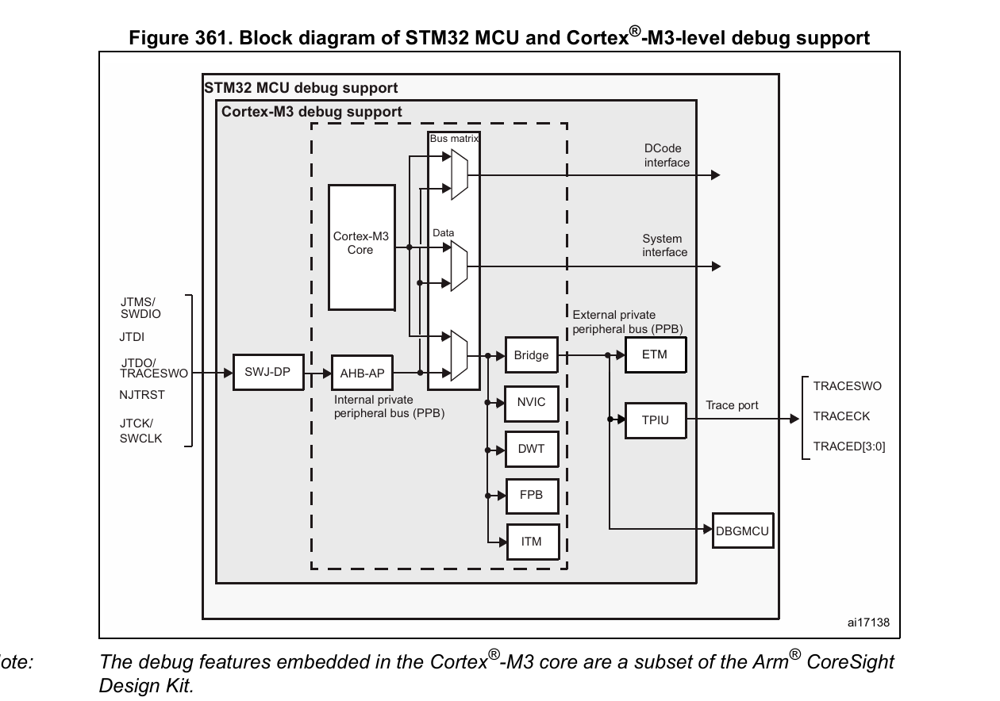

从这个图片来看看硬件的连接链路

```text
电脑
 │ USB
 ▼
ST-Link 调试探针
 │ SWD：SWDIO + SWCLK（VCC GND）
 ▼
MCU 内部的 SWJ-DP
 ▼
AHB-AP（AHB 访问端口）
 ▼
系统总线 / 内核私有外设（PPB）
```

SWD 或 JTAG 的调试访问先进入 **SWJ-DP**，再通过 **AHB-AP（AHB 访问端口）**访问芯片的存储器、系统外设和内核调试资源。图中的 **PPB 是内核私有外设总线**，连接 NVIC、DWT 等模块。**DWT（Data Watchpoint and Trace，数据观察点与跟踪单元）**中的 `CYCCNT` 是处理器时钟周期计数器，可用于测量程序执行耗时或实现计时，不是 STM32 的 TIM 定时器外设。

#### 怎么用

Keil studio为我们自动搭建好了调试链路

点开这个

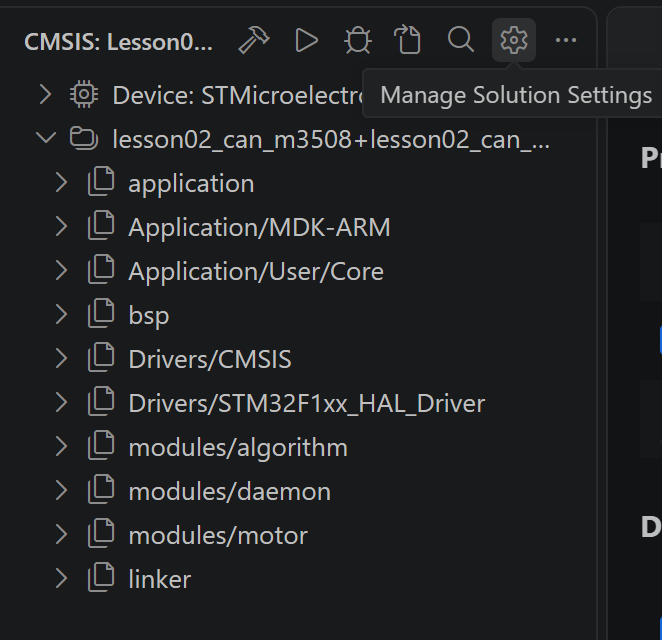

选取link的类型

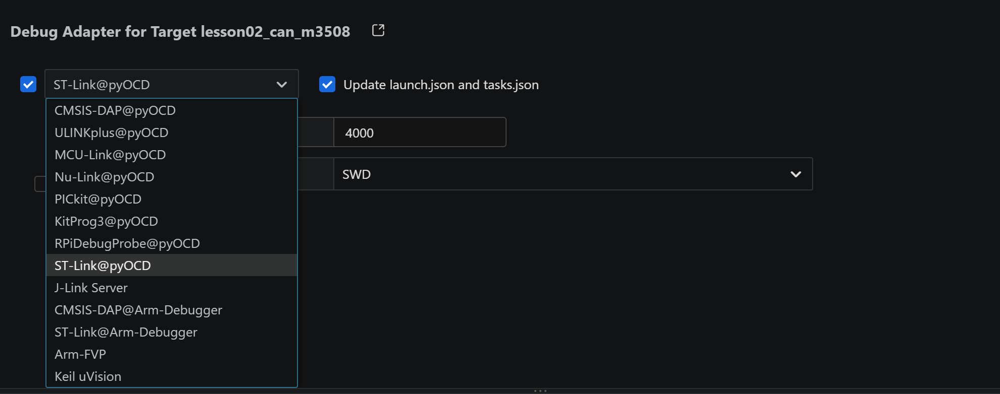


点击一下这个**Load & Debug Application**就行

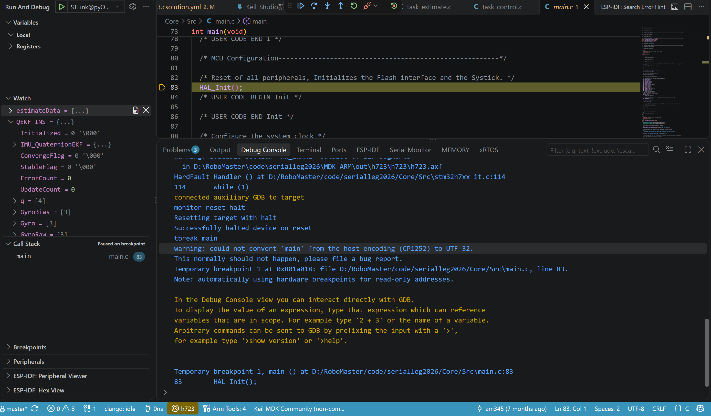

进入这个界面就说明成功烧录并进入debug界面了

##### 来看一下几个常见的功能

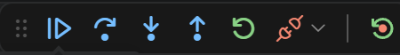

图中最左侧的点阵是拖动手柄。其后的按钮从左到右如下；把鼠标放到按钮上可查看名称。

| **按钮** | **作用** |
| --- | --- |
| Continue / Pause（继续 / 暂停） | 暂停时点击 Continue 恢复运行，直到再次命中断点、发生调试停止或手动暂停；运行时按钮变成 Pause，点击后可查看暂停位置与变量。 |
| Step Over（单步跳过） | 执行当前语句；遇到函数调用时，通常执行完整个函数后停在调用后的语句。“跳过”是指不进入函数逐行查看，并不是不执行函数。 |
| Step Into（单步进入） | 执行下一步；遇到有可用源码与调试信息的函数调用时，可进入函数内部逐步查看。 |
| Step Out（单步跳出） | 继续执行当前函数的剩余部分，通常在返回调用者后暂停；不是立即跳过剩余代码。 |
| Restart（重新启动调试） | 按当前调试配置重新启动调试过程，具体复位、下载等行为取决于配置。 |
| Stop / Disconnect（停止 / 断开） | 结束调试会话或断开与内核的调试连接。 |
| Reset Target（复位目标） | 最右侧分隔线后的按钮，用于复位芯片。 |

例如停在 `foo();` 时，Step Into 用来进入 `foo` 内部检查，Step Over 用来执行 `foo` 后看结果，进入 `foo` 后再点 Step Out 则运行到函数返回。单步过程中仍可能先命中其他断点；编译优化也可能使源码停靠位置不完全按行顺序变化。

##### 变量查看

选中变量右键然后找到 **add to watch**

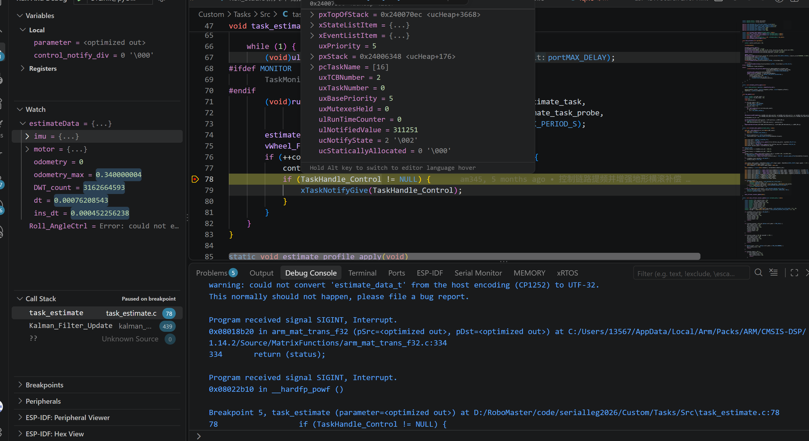

**Variables 与 Watch**

| **窗口** | **内容与用法** | **图中示例** |
| --- | --- | --- |
| Variables | 调试器根据当前选中的调用栈帧，自动列出函数参数、局部变量等。切换函数或调用栈帧时，内容会随之变化；Registers 分组用于查看 CPU 寄存器。 | Local 下的 `parameter` 和 `control_notify_div` 是当前栈帧中的函数参数和局部变量。 |
| Watch | 由你点击 + 添加变量名或表达式，持续保留关注的条目。例如 estimateData、estimateData.imu.pitch 或两个变量的差值。全局变量通常可跨函数查看 | estimateData 是手动添加的结构体，展开箭头可查看 imu、motor、dt 等成员。 |

vscode还有另外一个功能可以悬停在变量上看当前值，图中也呈现了

##### Trace And Live View

支持变量实时更新，不用每次暂停


